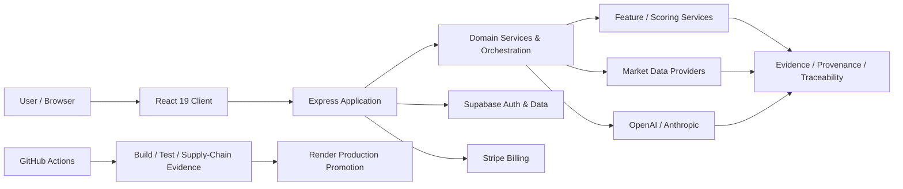

# CAPITAL-AI — Enterprise Financial Intelligence Platform

[](https://capital-ai.online)
[](https://nodejs.org)
[](https://www.typescriptlang.org)
[](#lizenz)

> **CAPITAL-AI** ist eine webbasierte FinTech-Plattform für Multi-Asset-Screening, quantitative Analysen, erklärbare Scorings und kontrollierte AI-gestützte Auswertungen. Version 0.6.0 befindet sich in der Beta-Phase und ist kein Ersatz für Anlage-, Rechts- oder Steuerberatung.

Diese Root-README ist die **Enterprise-Einstiegs- und Navigationsoberfläche** des Repositories. Sie beschreibt Produkt, Architektur, Entwicklungsmodell und zentrale Betriebsgrenzen, erzeugt jedoch **keine eigene Governance- oder Architektur-Authority**. Verbindliche Repository-Regeln werden aus [`/AGENTS.md`](./AGENTS.md), den kanonischen Projekt-/PVC-Zuordnungen, akzeptierten ADRs, aktiven ESS sowie den jeweiligen Registries aufgelöst.

---

## Enterprise Overview

CAPITAL-AI verbindet Finanzdaten, quantitative Modelle, AI-gestützte Analyse, nachvollziehbare Datenherkunft und kontrollierte Software-Lieferung in einer gemeinsamen Plattform. Der Schwerpunkt liegt auf **reproduzierbarer Entscheidungsunterstützung**, **Datenintegrität**, **erklärbarer Verarbeitung** und **klaren Trust Boundaries** zwischen Client, Backend, Datenquellen, AI-Providern, Authentifizierung, Billing und Deployment.

| Bereich | Plattformfunktion |
|---|---|
| **Multi-Asset Intelligence** | Screening und Analyse für Aktien, Indizes, Forex, Kryptowährungen und Rohstoffe |
| **Valuation & Quant** | Graham-/DCF-Verfahren, quantitative Scorings, Backtesting, Monte-Carlo- und Stressszenarien |
| **Market Context** | Markt-, Nachrichten-, Sentiment- und Momentum-Auswertungen |
| **Explainability & Evidence** | Datenherkunft, Evidence-IDs, Feature-/Scoring-Lineage und Audit-Evidence |
| **AI Assistance** | Providerneutrale AI-Orchestrierung mit OpenAI- und Anthropic-Anbindung |
| **Identity & Access** | Supabase-basierte Authentifizierung, MFA-Onboarding und Login-Step-up |
| **Commercial Platform** | Abonnementbasierte Funktionsstufen über Stripe |
| **Document Outputs** | PDF- und CSV-Ausgaben für Analyse-, Nachweis- und Compliance-Artefakte |
| **Controlled Delivery** | GitHub-basierter Entwicklungsprozess, Supply-Chain-Provenance und kontrollierte Render-Promotion |

## Plattformprinzipien

CAPITAL-AI wird entlang weniger verbindlicher Engineering-Prinzipien entwickelt:

- **Single source of truth statt Parallelarchitektur** — bestehende produktive Komponenten, Contracts und Authorities werden wiederverwendet, nicht dupliziert.
- **Fail-closed bei Schutzgrenzen** — fehlende oder widersprüchliche Authority, Security-, Ownership- oder Validierungssignale werden nicht als implizite Freigabe interpretiert.
- **Evidence vor Behauptung** — Compliance-, Accessibility-, Security- und Produktionsaussagen benötigen nachvollziehbare Evidence.
- **Datenherkunft vor Convenience** — Finanzdaten und Scoring-Ergebnisse sollen Provider, Abrufzeitpunkt und Lineage nachvollziehbar machen.
- **Human Governance für geschützte Aktionen** — Merge, geschützte Produktionsmutationen und vergleichbare High-Impact-Aktionen bleiben an die jeweils geltenden Human-/Owner-Gates gebunden.
- **Repository as source of truth** — Architektur, Roadmaps, ADRs, ESS, Controls, Tests und Evidence werden repository-seitig korreliert.

---

## Systemarchitektur



`server.ts` bleibt bewusst ein schlanker Prozesseinstieg. Middleware, Routen, Provider, Hintergrundprozesse, Billing-Ingress und Shutdown-Logik werden durch die modulare Server-Anwendung und ihre Laufzeitkomponenten bereitgestellt.

### Architekturgrenzen

| Ebene | Verantwortung |
|---|---|
| **Client** | Darstellung, Benutzerinteraktion und kontrollierte Aufrufe der Backend-Surfaces |
| **Application/API** | Authentifizierte Requests, Routing, Validierung, Service-Komposition und Integrationsgrenzen |
| **Domain & Scoring** | Finanzlogik, Feature Engineering, Scoring und Entscheidungsunterstützung innerhalb kanonischer Contracts |
| **Data & Evidence** | Datenaufnahme, Provenance, Evidence Management und Data-Quality-Projektionen |
| **AI Provider Plane** | Kontrollierte Nutzung externer AI-Provider ohne Übertragung von Repository-Authority |
| **Platform Services** | Authentifizierung, Billing, Dokumenterzeugung, Traceability und unterstützende Plattformfähigkeiten |
| **Delivery Plane** | Build, Tests, Supply-Chain-Evidence, Release- und Deployment-Kontrollen |

Google Gemini und `@google/genai` gehören nicht mehr zur aktiven Anwendungsarchitektur.

---

## Technologie-Stack

| Bereich | Komponenten |
|---|---|
| Frontend | React 19, TypeScript 5.8, Vite 6, Tailwind CSS 4, Motion, Recharts, D3 |
| Backend | Node.js 24, Express 4, TSX, Esbuild |
| AI | OpenAI SDK, Anthropic SDK |
| Authentifizierung und Daten | Supabase |
| Payments | Stripe |
| Tests und Qualität | Vitest, Node Test Runner, TypeScript, Repository- und Governance-Prüfungen |
| Dokumente | jsPDF 4.2.1 für Client-Reports; WeasyPrint 70.0 für gebrandete/tagged NotebookLM-PDFs; Poppler für Render-Smoke |
| Betrieb | Docker, Render, GitHub Actions |

<!-- README_VERSION_MATRIX:START -->
### Automatisch synchronisierte Runtime-Versionen

> **Projektionsvertrag:** `package.json#version` ist die einzige Plattformversions-Authority. Dieser README-Block ist eine deterministische, read-only Projektion aus kanonischen Repository-Deklarationen. `npm run readme:sync` aktualisiert ihn; `npm run readme:check` blockiert Drift.

| Komponente | Repository-Version | Authority |
|---|---:|---|
| CAPITAL-AI Plattform | `0.6.0` | `package.json#version` |
| Node.js Runtime | `24.18.0` | `.nvmrc` |
| Node.js Engine | `>=24.18.0 <25` | `package.json#engines.node` |
| TypeScript | `~7.0.2` | `package.json#devDependencies.typescript` |
| React | `^19.3.0` | `package.json#dependencies.react` |
| Vite | `^8.3.0` | `package.json#devDependencies.vite` |
| Tailwind CSS | `^4.1.14` | `package.json#devDependencies.tailwindcss` |
| OpenAI SDK | `^7.3.0` | `package.json#dependencies.openai` |
| Anthropic SDK | `^0.115.0` | `package.json#dependencies.@anthropic-ai/sdk` |
| Supabase JS | `^2.116.0` | `package.json#dependencies.@supabase/supabase-js` |
| Stripe Server SDK | `^22.3.0` | `package.json#dependencies.stripe` |
| Stripe Browser SDK | `^9.8.0` | `package.json#dependencies.@stripe/stripe-js` |
| Express | `^4.22.3` | `package.json#dependencies.express` |
| Vitest | `^4.1.11` | `package.json#devDependencies.vitest` |
<!-- README_VERSION_MATRIX:END -->

---

## Security & Trust Model

CAPITAL-AI behandelt Security, Datenintegrität und geschützte Mutationen als **Architekturgrenzen**, nicht als nachgelagerte Prozessschritte.

### Sicherheitskontrollen

- serverseitige Verarbeitung vertraulicher Provider- und Billing-Zugangsdaten
- Supabase-basierte Authentifizierung mit MFA-Onboarding und Login-Step-up
- ID-basierte Zuordnung von Benutzer- und Abonnementdaten
- Owner-Gates für geschützte Steuerungs- und Mutationspfade
- fail-closed Governance- und Workflow-Prüfungen
- Supply-Chain-Provenance und Release-Manifeste
- Human-/Owner-Review vor geschützten Repository-Mutationen
- Trennung von Repository-Änderung, Merge-Autorität und geschützter Produktionsmutation

Produktive Zugangsdaten gehören ausschließlich in die vorgesehenen Secret Stores. Sie dürfen weder in README-Dateien noch in Commits, Logs, Client-Bundles, Issues oder Pull-Request-Beschreibungen aufgenommen werden.

### Datenintegrität und Provenance

Finanzielle Auswertungen sollen nicht nur einen Wert, sondern dessen Entstehung nachvollziehbar machen. Dafür verwendet die Plattform unter anderem:

- feldbezogene Finanzdaten-Provenance mit Provider und Abrufzeitpunkt
- Evidence-IDs für nachvollziehbare Verarbeitungs- und Nachweisbeziehungen
- versionierte Feature- und Scoring-Lineage
- kontrollierte Data-Quality- und Validierungsgrenzen
- Trennung von Test-/Mock-Daten und produktiven Marktdaten
- Traceability-Artefakte für repository- und laufzeitbezogene Nachweise

Mock- und Testdaten sind ausschließlich in klar abgegrenzten Testkontexten zulässig und dürfen nicht als produktive Marktdaten erscheinen.

---

## AI Architecture

Die AI-Schicht ist eine integrierte Plattformfähigkeit, aber **keine Governance-Authority**. Externe Provider liefern Modellfähigkeiten; Repository-Regeln, fachliche Contracts, Datenintegritätsanforderungen und geschützte Aktionen bleiben innerhalb der CAPITAL-AI Trust Boundaries.

Aktiv angebunden sind:

- **OpenAI SDK** für AI-gestützte Analyse- und Orchestrierungsfähigkeiten
- **Anthropic SDK** als weiterer providerneutral eingebundener AI-Pfad

Provider-Ausgaben werden als externe/untrusted Inputs behandelt und müssen innerhalb ihrer jeweiligen fachlichen und technischen Contracts validiert werden.

---

## Governance & Repository Navigation

Die operative Navigation folgt der repository-weiten Arbeitsreihenfolge:

```text
PROJECT VALUE CHAIN / PVC
→ PROJECT ROADMAP
→ APPLICABLE ADR
→ APPLICABLE ESS
→ CODE / TESTS / EVIDENCE
```

### Kanonische Einstiegspunkte

| Zweck | Quelle |
|---|---|
| Repository Trust Root | [`AGENTS.md`](./AGENTS.md) |
| Projekt-/PVC-Routing | [`docs/projects/README.md`](./docs/projects/README.md) |
| Project Value Chain | [`docs/projects/PROJECT_VALUE_CHAIN.md`](./docs/projects/PROJECT_VALUE_CHAIN.md) |
| Architekturentscheidungen | [`docs/adr/`](./docs/adr/) |
| ESS / Systemverträge | [`.ai/skills/`](./.ai/skills/) und ESS-Registry |
| Governance Controls | [`docs/governance/`](./docs/governance/) |
| Projekt-Roadmaps | [`docs/projects/`](./docs/projects/) |
| Frontend-Architektur | [`docs/frontend/`](./docs/frontend/) |
| Source Code | [`src/`](./src/) und [`server/`](./server/) |
| Automatisierung / Validatoren | [`scripts/`](./scripts/) |
| Tests | [`tests/`](./tests/) |
| CI/CD | [`.github/`](./.github/) |

Die Root-README fasst diese Oberflächen zusammen, ersetzt sie jedoch nicht. Bei Widersprüchen wird die jeweils aktuelle Authority gemäß `/AGENTS.md` aufgelöst.

---

## Entwicklungs- und Änderungsprozess

Repository-Änderungen werden nicht direkt auf `main` vorgenommen. Der Entwicklungsfluss trennt Implementierung, technische Validierung, PR-Erstellung, Review, Merge und Produktionsmutation.

```text
Current main
→ Projekt / PVC / Owner auflösen
→ Roadmap + ADR + ESS prüfen
→ frischer scoped Branch
→ Implementierung
→ Validierung und Korrelation
→ Pull Request nach geltendem Owner-Gate
→ unabhängige GitHub Checks
→ Human/CODEOWNER Merge
→ ggf. separate Produktionsmutation
→ Evidence / Roadmap Sync
```

Zusätzliche Leitplanken:

- Änderungen erfolgen auf einem eigenen, scope-begrenzten Branch.
- Pull Requests verwenden die aktuelle deutsche CAPITAL-AI-Vorlage.
- Sicherheits-, Datenintegritäts- und Produktionsmutationen benötigen die jeweils vorgeschriebene Risiko-, Rollback- und Owner-Prüfung.
- AI-Agenten dürfen nur innerhalb ihrer aktuellen Tool-, Authority- und Ownership-Grenzen handeln.
- Änderungen an Stripe, Supabase oder Render werden als gesonderte externe bzw. produktive Aktionen behandelt, sofern die geltende Authority dies verlangt.
- Architekturentscheidungen und Systemverträge werden über ADR-, ESS-, Control-, Evidence- und Traceability-Artefakte nachvollziehbar gehalten.

---

## Release & Production Delivery

Die Produktionsbereitstellung ist vom normalen Repository-Schreibpfad getrennt. Render Auto Deploy bleibt ausgeschaltet; die produktive Promotion erfolgt über die verifizierte `main`-Pipeline mit Build-/Test-Evidence, Supply-Chain-Attestation, exaktem SHA-Bezug und nachgelagerter Identitätsprüfung.

Die konkrete Release- und Deployment-Authority wird nicht aus dieser README abgeleitet. Maßgeblich sind die aktuellen Repository-Controls, akzeptierten ADRs/ESS und die zuständigen Operations-Projektoberflächen.

---

## Dokumente, Reporting & Branding

PDF-Ausgaben verwenden einen gemeinsamen CAPITAL-AI Brand-/Metadaten-Contract und die produktiven Design-Tokens.

- **Client-Reports:** `src/platform/PdfReporting/pdfBrand.ts` + jsPDF. Das Accessibility-Profil `client-jsPDF` setzt Sprache und Metadaten, behauptet aber bewusst keine PDF/UA-/Tagged-PDF-Konformität.
- **Documentation-as-Code / NotebookLM:** `scripts/docs/export_notebooklm_pdfs.py` + WeasyPrint 70.0. Dieser Pfad erzeugt semantisches, tagged PDF/UA-1 und wird separat über `scripts/docs/verify_pdf_render.py` geprüft.
- **Branding Manifest v6.0:** Gold `#F9BF21`, Purple `#8D26FF`, Emerald `#44DE88`, Rose `#F87171`, Background `#08080C`/`#121215`, Inter für Überschriften, Poppins für Body und JetBrains Mono für Tech-/Dateninhalte.
- **Runtime-Authority für Design-Tokens:** `docs/frontend/design-tokens.json`.
- **Evidence-Gate:** Accessibility- oder regulatorische Konformität wird nicht allein aus Branding oder Renderer-Konfiguration abgeleitet.

Reproduzierbarer Documentation-PDF-Smoke:

```bash
pip install -r scripts/docs/requirements-notebooklm-pdf.txt
python3 scripts/docs/export_notebooklm_pdfs.py --smoke --out-dir /tmp/capital-ai-pdf-smoke
python3 scripts/docs/verify_pdf_render.py \
  /tmp/capital-ai-pdf-smoke/CAPITAL_AI_NotebookLM_PDF_UA_Smoke.pdf \
  --expect-tagged yes
```

---

## Lokale Entwicklung

### Voraussetzungen

- Node.js `>=24.18.0 <25`
- npm in einer mit Node.js 24 kompatiblen Version
- Zugriff auf die erforderlichen Entwicklungsvariablen gemäß `.env.example`
- optional für Documentation-PDFs: Python `>=3.10`, die gepinnten Abhängigkeiten aus `scripts/docs/requirements-notebooklm-pdf.txt` und Poppler-CLI-Tools für Render-Verifikation

### Repository klonen und starten

```bash
git clone https://github.com/capital-ai-online/Finance.git
cd Finance
npm ci
npm run dev
```

Die Anwendung ist lokal standardmäßig unter `http://localhost:3000` erreichbar.

Produktionsstart nach erfolgreichem Build:

```bash
npm start
```

---

## Qualität, Tests & Validierung

Für einen vollständigen lokalen Engineering-Check stehen unter anderem folgende Befehle zur Verfügung:

```bash
npm run lint
npm run readme:check
npm run docs:hygiene:check
npm run governance:control-plane
npm test
npm run build
npm run predeploy:check
```

| Befehl | Zweck |
|---|---|
| `npm run dev` | Entwicklungsserver über `tsx server.ts` starten |
| `npm run lint` | TypeScript-Prüfung ohne Ausgabe von Build-Dateien |
| `npm run readme:sync` | README-Versionen deterministisch aus Repository-Authorities projizieren |
| `npm run readme:check` | README-Projektionsdrift fail-closed erkennen |
| `npm run docs:hygiene:check` | Root-Policy, Document Registry, Lifecycle-/Sprachwerte und Registry-Zielpfade fail-closed validieren |
| `npm run governance:control-plane` | Authority-, Version-, Router-, ADR-/ESS- und Governance-Invarianten validieren |
| `npm test` | Vitest- und PR-Governance-Tests einschließlich PDF-Brand-/Renderer-Guards ausführen |
| `npm run build` | Sicherheitsinvarianten prüfen, Frontend bauen, öffentliche Routen vor-rendern, Server bündeln und Release-Manifest erzeugen |
| `npm run predeploy:check` | Deployment-Bereitschaft und Supply-Chain-Provenance prüfen |
| `npm run repository:validate` | Repository-Konventionen validieren |
| `npm run traceability:build` | Traceability-Artefakte erzeugen |
| `npm run rag:build-index` | internen RAG-Index aufbauen |

`NOT RUN` wird in CAPITAL-AI nicht als `PASS` behandelt. Die tatsächlich ausgeführten Checks und deren Evidence sind für jede Änderung separat zu bewerten.

---

## Compliance & Assurance Boundary

CAPITAL-AI enthält technische und organisatorische Kontrollmechanismen, die Datenschutz, Nachvollziehbarkeit, Security und regulatorisch relevante Engineering-Anforderungen unterstützen. Daraus folgt jedoch **keine automatische rechtliche oder regulatorische Konformitätsbehauptung**.

Aussagen über beispielsweise DSGVO-, MiFID-II-, BaFin-, BFSG-, PDF/UA- oder AI-Act-Konformität setzen eine aktuelle fachliche/technische und gegebenenfalls rechtliche Bewertung sowie belastbare Scope- und Produktions-Evidence voraus.

Ebenso stellt diese README weder eine Zertifizierung noch einen Auditbericht dar.

---

## Wichtige Nutzungshinweise

- Die Plattform befindet sich in aktiver Entwicklung.
- Analyse- und Scoring-Ergebnisse können unvollständig, verzögert oder fehlerhaft sein.
- Externe Daten- und AI-Provider können zeitweise nicht verfügbar sein.
- Finanzielle Entscheidungen dürfen nicht ausschließlich auf automatisierten Ergebnissen der Plattform beruhen.
- Test-, Demo- und Mock-Daten dürfen nicht als produktive Finanzdaten ausgegeben werden.
- Diese Software ersetzt keine individuelle Anlage-, Rechts- oder Steuerberatung.

---

## Governance, Inhaber & Repository-Status

- Inhaber: Sven Kulessa
- Kontakt: [sven.kulessa@capital-ai.online](mailto:sven.kulessa@capital-ai.online)
- Plattformversion: `0.6.0 Beta`
- Plattformversions-Authority: `package.json#version`; diese README ist nur Projektion
- Repository: `capital-ai-online/Finance`
- Sichtbarkeit: privat
- Lizenz: proprietär
- Repository Trust Root: [`/AGENTS.md`](./AGENTS.md)

## Lizenz

Dieses Repository und seine Inhalte sind proprietär. Nutzung, Vervielfältigung, Weitergabe oder Veränderung richten sich nach den vom Inhaber ausdrücklich eingeräumten Rechten.
