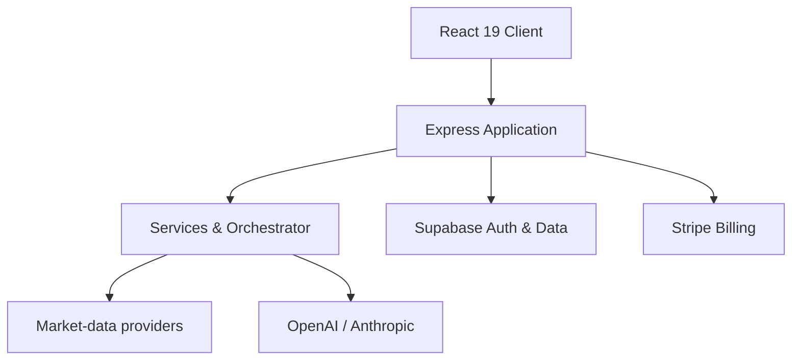

# CAPITAL-AI — Financial Intelligence & Multi-Asset Analytics

[](https://capital-ai.online)
[](https://nodejs.org)
[](https://www.typescriptlang.org)
[](#lizenz)

> CAPITAL-AI ist eine webbasierte FinTech-Plattform für Multi-Asset-Screening, quantitative Analysen, erklärbare Scorings und kontrollierte AI-gestützte Auswertungen. Version 0.6.0 befindet sich in der Beta-Phase und ist kein Ersatz für Anlage-, Rechts- oder Steuerberatung.

## Produktumfang

- Multi-Asset-Screening für Aktien, Indizes, Forex, Kryptowährungen und Rohstoffe
- fundamentale Bewertungsverfahren einschließlich Graham- und DCF-Analysen
- quantitative Scorings, Backtesting, Monte-Carlo- und Stressszenarien
- Markt-, Nachrichten- und Sentiment-Auswertungen
- PDF- und CSV-Exporte für Analyse- und Compliance-Artefakte
- abonnementbasierte Funktionsstufen über Stripe
- Authentifizierung und Datenhaltung über Supabase
- providerneutrale AI-Orchestrierung mit OpenAI- und Anthropic-Anbindung
- nachvollziehbare Datenherkunft, Scoring-Lineage und Audit-Evidence

## Architektur



Der Prozesseinstieg `server.ts` bleibt bewusst dünn. Middleware, Routen, Provider, Hintergrundprozesse, Billing-Ingress und Shutdown-Logik werden durch die modulare Server-Anwendung und ihre Laufzeitkomponenten bereitgestellt.

## Technologiestack

| Bereich | Komponenten |
|---|---|
| Frontend | React 19, TypeScript 5.8, Vite 6, Tailwind CSS 4, Motion, Recharts, D3 |
| Backend | Node.js 24, Express 4, TSX, Esbuild |
| AI | OpenAI SDK, Anthropic SDK |
| Authentifizierung und Daten | Supabase |
| Payments | Stripe |
| Tests und Qualität | Vitest, Node Test Runner, TypeScript, Repository- und Governance-Prüfungen |
| Dokumente | jsPDF |
| Betrieb | Docker, Render, GitHub Actions |

Google Gemini und `@google/genai` gehören nicht mehr zur aktiven Anwendungsarchitektur.

## Voraussetzungen

- Node.js `>=24.18.0 <25`
- npm in einer mit Node.js 24 kompatiblen Version
- Zugriff auf die erforderlichen Entwicklungsvariablen gemäß `.env.example`

Produktive Zugangsdaten gehören ausschließlich in die dafür vorgesehenen Secret Stores. Sie dürfen weder in die README noch in Commits, Logs, Client-Bundles oder Pull-Request-Beschreibungen aufgenommen werden.

## Lokale Entwicklung

```bash
git clone https://github.com/SvenKulessa/Finance.git
cd Finance
npm ci
npm run dev
```

Die Anwendung ist lokal standardmäßig unter `http://localhost:3000` erreichbar.

## Prüfung und Build

```bash
npm run lint
npm test
npm run build
npm run predeploy:check
```

| Befehl | Zweck |
|---|---|
| `npm run dev` | Entwicklungsserver über `tsx server.ts` starten |
| `npm run lint` | TypeScript-Prüfung ohne Ausgabe von Build-Dateien |
| `npm test` | Vitest- und PR-Governance-Tests ausführen |
| `npm run build` | Sicherheitsinvarianten prüfen, Frontend bauen, öffentliche Routen vor-rendern, Server bündeln und Release-Manifest erzeugen |
| `npm run predeploy:check` | Deployment-Bereitschaft und Supply-Chain-Provenance prüfen |
| `npm run repository:validate` | Repository-Konventionen validieren |
| `npm run traceability:build` | Traceability-Artefakte erzeugen |
| `npm run rag:build-index` | internen RAG-Index aufbauen |

Produktionsstart nach erfolgreichem Build:

```bash
npm start
```

## Sicherheit und Datenintegrität

CAPITAL-AI verwendet mehrere technische und organisatorische Kontrollschichten:

- serverseitige Verarbeitung vertraulicher Provider- und Billing-Zugangsdaten
- Supabase-basierte Authentifizierung mit MFA-Onboarding und Login-Step-up
- ID-basierte Zuordnung von Benutzer- und Abonnementdaten
- Owner-Gates für geschützte Steuerungs- und Mutationspfade
- feldbezogene Finanzdaten-Provenance mit Provider, Abrufzeitpunkt und Evidence-ID
- versionierte Feature- und Scoring-Lineage
- fail-closed Governance- und Workflow-Prüfungen
- Supply-Chain-Provenance und Release-Manifeste
- Human-/Owner-Review vor geschützten Repository-Mutationen

Diese Kontrollen unterstützen Datenschutz, Nachvollziehbarkeit und regulatorische Governance. Aussagen über DSGVO-, MiFID-II-, BaFin- oder AI-Act-Konformität setzen jedoch eine jeweils aktuelle fachliche und rechtliche Prüfung sowie belastbare Produktions-Evidence voraus.

## Entwicklungs- und Änderungsprozess

- Änderungen erfolgen auf einem eigenen Branch und über einen Pull Request.
- Pull Requests verwenden die deutsche CAPITAL-AI-Vorlage.
- Sicherheits-, Datenintegritäts- und Produktionsmutationen benötigen eine dokumentierte Risiko-, Rollback- und Owner-Prüfung.
- AI-Agenten dürfen Mutationen vorbereiten oder anfragen, aber geschützte Mutationen nicht selbst freigeben.
- Änderungen an Stripe, Supabase oder Render werden als gesonderte Produktionsaktionen behandelt.
- Nach erfolgreichem Merge wird der zugehörige Remote-Branch gelöscht.
- Architekturentscheidungen und Systemverträge werden über ADR-, ESS-, Evidence- und Traceability-Dokumente nachvollziehbar gehalten.

## Wichtige Hinweise

- Die Plattform befindet sich in aktiver Entwicklung.
- Analyse- und Scoring-Ergebnisse können unvollständig, verzögert oder fehlerhaft sein.
- Externe Daten- und AI-Provider können zeitweise nicht verfügbar sein.
- Finanzielle Entscheidungen dürfen nicht ausschließlich auf automatisierten Ergebnissen der Plattform beruhen.
- Mock- und Testdaten sind ausschließlich in klar abgegrenzten Testkontexten zulässig und dürfen nicht als produktive Marktdaten erscheinen.

## Governance und Inhaber

- Inhaber: Sven Kulessa
- Kontakt: [sven.kulessa@capital-ai.online](mailto:sven.kulessa@capital-ai.online)
- Plattformversion: `0.6.0 Beta`
- Repository: privat
- Lizenz: proprietär

## Lizenz

Dieses Repository und seine Inhalte sind proprietär. Nutzung, Vervielfältigung, Weitergabe oder Veränderung richten sich nach den vom Inhaber ausdrücklich eingeräumten Rechten.
