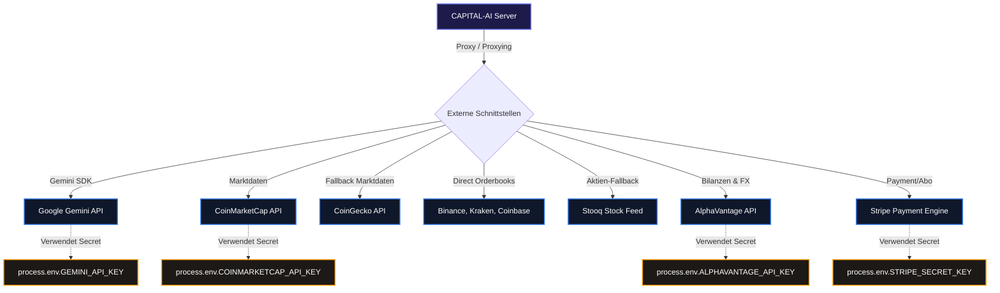

# 🌐 API-Flows & API Integrationen
> **Spezifikation:** Version 0.5.5 (Beta-Phase)  
> **Konformität:** RESTful Standards, JSON Payload Validation, Secure Header Routing

Dieses Dokument verzeichnet alle internen API-Endpunkte der CAPITAL-AI Plattform sowie die angebundenen externen Datenprovider (Finanz-Feeds, Kreditkarten-Verarbeitung und AI-Services).

---

## 🧭 Navigationsmenü

* [🏠 Hauptübersicht (README.md)](README.md)
* [⏳ Scheduler.md](Scheduler.md)
* [📡 Events.md](Events.md)
* [🌐 API-Flows.md](API-Flows.md)
* [🔄 Datenflüsse.md](Datenflüsse.md)
* [⏳ Cronjobs.md](Cronjobs.md)

---

## 🌐 1. Interne API-Routen (Express API)

Alle Routen sind unter `/api/*` verfügbar. Der Server erzwingt standardisierte JSON-Payloads und bindet für alle Routen die Middleware-Sicherheitskette ein.

| Route | HTTP-Methode | Beschreibung | Erforderliche Header / Parameter | Status |
| :--- | :---: | :--- | :--- | :---: |
| `/api/raw-materials` | `GET` | Analysiert Rohstoffe über Multi-Agenten-Pipeline. | `?name=GOLD` (Query-Parameter) | 🟢 Aktiv |
| `/api/stocks` | `GET` | Analysiert Aktien (Value, Growth, DCF). | `?symbol=AAPL` (Query-Parameter) | 🟢 Aktiv |
| `/api/cryptos` | `GET` | Analysiert Bluechip-Kryptowährungen. | `?symbol=BTC` (Query-Parameter) | 🟢 Aktiv |
| `/api/meme-coins` | `GET` | Analysiert speculative Meme-Coins. | `?coin=PEPE` (Query-Parameter) | 🟢 Aktiv |
| `/api/page-views` | `GET` | Liefert aggregierte simulated Page-Views. | Keine | 🟢 Aktiv |
| `/api/health-check` | `GET` | System-Integritätsprüfung (Datenbank, APIs). | `x-health-check-token` (Optionaler Admin-Header) | 🟢 Aktiv |
| `/api/stripe/checkout`| `POST` | Erstellt eine Stripe-Bezahlsession. | Bearer JWT (Authentifizierung) | 🟢 Aktiv |
| `/api/stripe/webhook` | `POST` | Stripe-Zahlungsbestätigungen. | `stripe-signature` (Signatur-Verifizierung) | 🟢 Aktiv |

### 🔒 Spezielle Admin- und Diagnoserouten
* **`/api/health-check`**:
  Verifiziert die Erreichbarkeit von Drittanbieter-Schnittstellen und kritischen lokalen Systemkomponenten. Falls im Request-Header `x-health-check-token` oder `x-orchestrator-admin-token` mitgeliefert wird, gibt das System erweiterte Diagnose-Details (wie latente Ping-Latenzen der APIs, Speicherbelegung des Containers und genaue Fehlermeldungen von Supabase) zurück. Fehlt der Header, wird eine kompakte, sichere Statusmeldung ausgegeben.

---

## 🔌 2. Externe API-Integrationen (Daten-Feeds & Services)

CAPITAL-AI verbindet sich mit den weltweit führenden Finanzdaten- und AI-Schnittstellen. Sämtliche Verbindungen sind serverseitig gekapselt.

### Die angebundenen externen APIs im Detail:

1. **Google Gemini API (`gemini-2.5-flash`)**:
   * **Typ:** AI-Modell Endpunkt.
   * **Zweck:** Füttert die 14 Agenten mit qualitativen Marktanalysen, Stimmungsberichten und Strukturklassifizierungen.
   * **Bibliothek:** `@google/genai` TypeScript SDK.

2. **CoinMarketCap API (`pro-api.coinmarketcap.com`)**:
   * **Typ:** REST API (JSON).
   * **Zweck:** Primärer Datenfeed für Krypto-Preise, Marktkapitalisierung und Handelsvolumina.

3. **CoinGecko API (`api.coingecko.com`)**:
   * **Typ:** Public REST API (JSON).
   * **Zweck:** Sekundärer Krypto-Fallback-Feed bei Verbindungsfehlern von CoinMarketCap.

4. **Binance, Kraken, Coinbase APIs**:
   * **Typ:** Public REST (Tickers).
   * **Zweck:** Direkter Abruf von Echtzeitkursen zur Verifikation der Orderbuch-Dichte und Spread-Kalkulationen.

5. **AlphaVantage API (`www.alphavantage.co`)**:
   * **Typ:** Premium Finance REST API.
   * **Zweck:** Abruf historischer Aktiendaten, Devisenkurse (Forex) und physischer Rohstoff-Spot-Preise.

6. **Stooq Stock Feed (`stooq.com`)**:
   * **Typ:** CSV-Schnittstelle.
   * **Zweck:** Robustes, historisches Fallback-System für globale Aktienindizes und Rohstoffe.

7. **Stripe API (`api.stripe.com`)**:
   * **Typ:** REST SDK.
   * **Zweck:** Sichere Zahlungsabwicklung, Erstellung von Kunden-Portalen und Verifizierung aktiver Abonnements für Premium-Auswertungen.
