# 🌲 Abhängigkeiten & Modul-Beziehungen
> **Spezifikation:** Version 0.5.5 (Beta-Phase)  
> **Konformität:** Strikt hierarchische Kapselung, Keine zyklischen Importe

Dieses Dokument bildet das Modul-Import-Netzwerk der CAPITAL-AI Plattform ab. Es dient Software-Entwicklern und System-Auditoren dazu, die Verflechtung der Software-Komponenten nachzuvollziehen und unbeabsichtigte zyklische Abhängigkeiten (Circular Dependencies) zu vermeiden.

---

## 🧭 Navigationsmenü

* [🏠 Hauptübersicht (README.md)](README.md)
* [🌲 Abhängigkeiten.md](Abhängigkeiten.md)
* [📊 Komponentenübersicht.md](Komponentenübersicht.md)

---

## 🌲 Modul-Import-Netzwerk (Mermaid Dependency Graph)

Die folgende Architekturkarte visualisiert, wie die Quellcode-Dateien aufeinander verweisen. Das System folgt einem strikten **Top-Down-Entwurfsmuster** (Routing ──> Orchestrierung ──> Agenten/Services ──> Validierung/Konfiguration ──> Datentypen).

```mermaid
graph TD
    %% Styling
    classDef main fill:#1e1b4b,stroke:#818cf8,stroke-width:2px,color:#fff;
    classDef routes fill:#1e293b,stroke:#3b82f6,stroke-width:2px,color:#fff;
    classDef orchestrators fill:#311042,stroke:#d946ef,stroke-width:2px,color:#fff;
    classDef agents fill:#0f172a,stroke:#10b981,stroke-width:2px,color:#fff;
    classDef services fill:#0c4a6e,stroke:#0ea5e9,stroke-width:2px,color:#fff;
    classDef configs fill:#1c1917,stroke:#f59e0b,stroke-width:2px,color:#fff;
    classDef types fill:#2d1a12,stroke:#ff7a00,stroke-width:1px,color:#fff;

    %% Entry Point
    S[server.ts Entry Point]:::main
    
    %% Routes Layer
    S --> R_H[src/routes/healthCheck.ts]:::routes
    S --> R_M[src/server/middleware.ts]:::routes
    
    %% Orchestration Layer
    S --> RO[src/lib/requestOrchestrator.ts]:::orchestrators
    S --> O_S[src/orchestrator/stockOrchestrator.ts]:::orchestrators
    S --> O_C[src/orchestrator/cryptoOrchestrator.ts]:::orchestrators
    S --> O_M[src/orchestrator/memeCoinOrchestrator.ts]:::orchestrators
    S --> O_R[src/orchestrator/rawMaterialsOrchestrator.ts]:::orchestrators
    
    %% Agent Layer
    O_S --> A_S_Class[src/agents/stockClassificationAgent.ts]:::agents
    O_S --> A_S_Fund[src/agents/stockFundamentalsAgent.ts]:::agents
    O_S --> A_S_Val[src/agents/stockValuationAgent.ts]:::agents
    O_S --> A_S_Risk[src/agents/stockRiskAgent.ts]:::agents
    
    O_C --> A_C_Class[src/agents/cryptoClassificationAgent.ts]:::agents
    O_C --> A_C_On[src/agents/cryptoOnChainAgent.ts]:::agents
    O_C --> A_C_Sent[src/agents/cryptoSentimentAgent.ts]:::agents
    O_C --> A_C_Risk[src/agents/cryptoRiskAgent.ts]:::agents
    
    O_M --> A_M_Sent[src/agents/memeSentimentAgent.ts]:::agents
    O_M --> A_M_Risk[src/agents/memeRiskAgent.ts]:::agents
    
    O_R --> A_R_Class[src/agents/classificationAgent.ts]:::agents
    O_R --> A_R_Fund[src/agents/fundamentalsAgent.ts]:::agents
    O_R --> A_R_Risk[src/agents/riskAgent.ts]:::agents
    O_R --> A_R_Val[src/agents/valuationAgent.ts]:::agents

    %% Service Layer
    O_S --> S_S[src/services/stockScoringService.ts]:::services
    O_C --> S_C[src/services/cryptoScoringService.ts]:::services
    O_M --> S_M[src/services/memeCoinScoringService.ts]:::services
    O_R --> S_R[src/services/rawMaterialsScoring.ts]:::services

    %% Configurations & Defaults Layer
    O_S & A_S_Class --> C_S[src/config/stockConfig.ts]:::configs
    O_R & A_R_Class --> C_R[src/config/rawMaterialsConfig.ts]:::configs

    %% Types Layer (Universal Base)
    S_S & A_S_Class & O_S -.-> T_S[src/types/stock.ts]:::types
    S_R & A_R_Class & O_R -.-> T_R[src/types/rawMaterials.ts]:::types
    S_M & A_M_Sent & O_M -.-> T_M[src/types/memeCoin.ts]:::types
    S_C & A_C_Class & O_C -.-> T_C[src/types/crypto.ts]:::types
```

---

## 🛡️ Richtlinien für Modul-Beziehungen (Anti-Circular-Mandates)

Um eine hervorragende Wartbarkeit (Maintainability) zu bewahren, gelten folgende strenge Programmiergebote:

1. **Keine bidirektionalen Imports (No Circular Imports)**:  
   Ein Modul auf tieferer Ebene (z.B. ein Service unter `/src/services/`) darf **niemals** Module auf höherer Ebene (z.B. Orchestratoren oder Routen) importieren. Daten fließen ausschließlich von oben nach unten.
2. **Kapselung über Typen**:  
   Klassen kommunizieren ausschließlich über stark typisierte Schnittstellen, die in `/src/types/` definiert sind. Dies minimiert die direkte Koppelung zwischen den Klassen und erlaubt das einfache Austauschen von Komponenten (z.B. zu Mock-Zwecken beim automatisierten Testing).
3. **Zentrale Konfigurationsprüfung**:  
   Statische Assetprofile und Defaultwerte sind strikt in `/src/config/` abgelegt und werden von den Orchestratoren geladen, um Daten-Redundanz im Programmcode zu verhindern.
4. **Winston Logger Singleton**:  
   Der Logger ist eine global verfügbare Singleton-Instanz und darf von jeder Software-Ebene direkt importiert und verwendet werden, ohne dass die Request-ID manuell durchgereicht werden muss (ermöglicht durch `AsyncLocalStorage`).
