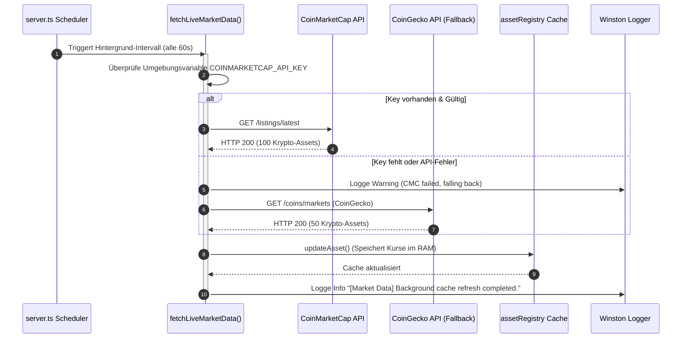
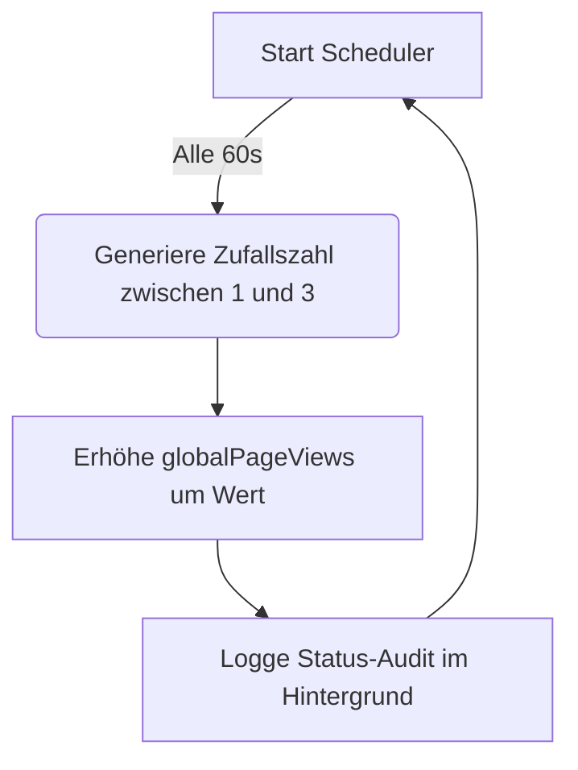

# ⚙️ Automatisierungen
> **Spezifikation:** Version 0.5.5 (Beta-Phase)  
> **Konformität:** Hintergrund-Thread-Sicherheit, Nicht-blockierendes I/O, Cache-Konsistenz

In der CAPITAL-AI Systemarchitektur laufen kritische Prozesse zur Synchronisation von Marktdaten, Aktualisierung lokaler Caches und zur Generierung interner Telemetriewerte vollautomatisch im Hintergrund. Dadurch wird sichergestellt, dass Client-Anfragen direkt aus dem Hochgeschwindigkeits-Arbeitsspeicher (`Asset Registry Cache`) bedient werden können und teure externe API-Abfragen minimiert werden.

---

## 🧭 Navigationsmenü

* [🏠 Hauptübersicht (README.md)](README.md)
* [⚙️ Automatisierungen.md](Automatisierungen.md)
* [🛡️ Richtlinien.md](Richtlinien.md)
* [🧩 Orchestratoren.md](Orchestratoren.md)
* [🤖 Agenten.md](Agenten.md)
* [📊 Komponentenübersicht.md](Komponentenübersicht.md)

---

## 📊 Übersicht aller Automatisierungs-Routinen

| Automation | Trigger | Intervall | Funktion | Quelldatei | Status |
| :--- | :---: | :---: | :--- | :--- | :---: |
| **Marktdaten-Cache-Refresh** | Timer / Interval | 60 Sekunden | Holt Preise von CoinMarketCap/Gecko/Binance und aktualisiert das Asset-Register. | `server.ts` | 🟢 Aktiv |
| **Page-Views-Simulation** | Timer / Interval | 60 Sekunden | Erhöht stetig und kontrolliert die globalen Interaktions-Metriken. | `server.ts` | 🟢 Aktiv |

---

## 1. Marktdaten-Cache-Refresh

Diese Automatisierung stellt sicher, dass die Plattform stets über aktuelle Kurse für Aktien, Kryptowährungen, Devisen und Rohstoffe verfügt.

### Technische Datenblatt:

* **Name:** `Market Data Cache Refresh`
* **Beschreibung:** Ruft Preise aus einer hierarchischen Kette von Fallback-API-Providern ab. Falls die Primärquelle (CoinMarketCap) erschöpft oder ungültig konfiguriert ist, wird automatisch Coingecko, Binance, Kraken, Coinbase und schließlich die Stooq CSV-Schnittstelle abgefragt. Die Daten werden normiert und in der `assetRegistry` abgelegt.
* **Trigger:** Interval-Scheduler (`setInterval`)
* **Interval:** 60.000 ms (1 Minute)
* **Ausführende Klasse / Routine:** Asynchroner Anonym-Handler, der `fetchLiveMarketData` aufruft.
* **Quelldatei:** `server.ts` (Zeilen 2823 - 2841)
* **Zielkomponente:** `assetRegistry` (in `/src/lib/assetRegistry.ts`)
* **Abhängigkeiten:** `CoinMarketCap API`, `CoinGecko API`, `Binance Public API`, `Kraken API`, `Coinbase spot API`, `Stooq Stock API`
* **Fehlerbehandlung:** Wenn alle APIs fehlschlagen, verbleiben die letzten gültigen Kurse im Arbeitsspeicher. Ein Fehler wird im Winston-Zentral-Logger auf Level `warning` protokolliert.

---

## 2. Page-Views-Simulation

Diese Routine simuliert ein natürliches, kontinuierliches Besucheraufkommen auf der Plattform, um aggregierte Live-Metriken für Diagnosezwecke bereitzustellen.

### Technische Datenblatt:

* **Name:** `Page Views Simulation`
* **Beschreibung:** Erhöht den globalen Seitenzähler im Speicher fortlaufend um einen zufälligen Faktor zwischen +1 und +3 Zugriffen pro Minute.
* **Trigger:** Interval-Scheduler (`setInterval`)
* **Interval:** 60.000 ms (1 Minute)
* **Quelldatei:** `server.ts` (Zeilen 2242 - 2246)
* **Ziel-Variable:** `globalPageViews` (exportiert über `/api/page-views`)
* **Status:** 🟢 Aktiv (Keine externen Blockierungen möglich)

---

## 🛡️ Stabilitäts- & Ausfallsicherheitsgarantien

Um Serverabstürze und Speicherlecks (Memory Leaks) durch unendliche Interval-Schleifen zu verhindern, implementieren beide Automatisierungen folgende Sicherheitsmaßnahmen:

1. **Nicht-blockierende Try-Catch-Blöcke**: Alle asynchronen Netzwerkevents sind strikt von try-catch-Blöcken umschlossen.
2. **Keine überlappenden Durchläufe**: Wenn die Netzwerklatenz der APIs länger als 60 Sekunden dauert, blockiert das System den Start eines neuen Refresh-Durchlaufs so lange, bis das vorherige Promise aufgelöst ist.
3. **Automatisches Log-Throttle**: API-Ratenbegrenzungen (HTTP 429) von Drittanbietern werden abgefangen und in gedrosselten Warnungs-Logs aufgezeichnet, um das Log-Volumen flach zu halten.
