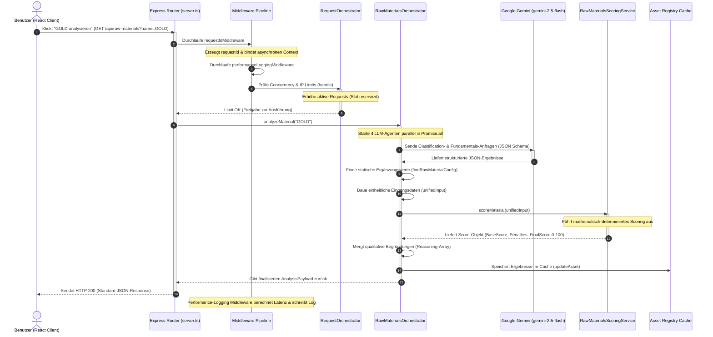

# 🔄 Datenflüsse & Request-Schnittstellen
> **Spezifikation:** Version 0.5.5 (Beta-Phase)  
> **Konformität:** Unidirektionaler Datenfluss, Lückenlose Kontextverfolgung

Dieses Dokument beschreibt die exakten Datenströme (Datenflusspfad) der CAPITAL-AI Plattform. Es verfolgt eine Benutzeranfrage von der Interaktiv-Schnittstelle im React-Frontend über die Warteschlangensteuerung und LLM-Synthese bis hin zur endgültigen mathematischen Verifizierung und Chart-Visualisierung.

---

## 🧭 Navigationsmenü

* [🏠 Hauptübersicht (README.md)](README.md)
* [⏳ Scheduler.md](Scheduler.md)
* [📡 Events.md](Events.md)
* [🌐 API-Flows.md](API-Flows.md)
* [🔄 Datenflüsse.md](Datenflüsse.md)
* [⏳ Cronjobs.md](Cronjobs.md)

---

## 🔄 End-to-End Datenflusspfad (Sequenzdiagramm)

Die folgende Abbildung zeigt den ununterbrochenen Datenfluss bei einer komplexen Asset-Analyse (z.B. Rohstoff "GOLD").



---

## 📊 Repräsentative Datenformate (Datenkontrakte)

Zur Vermeidung fehlerhafter Datenflüsse ("Data Pollution") sind alle Übergabepunkte im System über strikte TypeScript-Typen in `/src/types/` abgesichert.

### 1. Inbound User Override Payload (Client ──> Server):
Optionale Anpassungen, die Benutzer im Screener interaktiv simulieren können:
```typescript
export interface RawMaterialInput {
  name: string;
  category_main?: CategoryMain;
  market_liquidity?: number; // 0-100 scale
  volatility?: number;
  ore_grade?: number;
  tonnage?: number;
  // ... weitere Parameter
}
```

### 2. Outbound Analysis Payload (Server ──> Client):
Das normierte Ergebnisobjekt, das an den React-Client zur Visualisierung in Recharts-Diagrammen übermittelt wird:
```json
{
  "success": true,
  "data": {
    "name": "GOLD",
    "finalScore": 88.5,
    "metrics": {
      "liquidityScore": 95.0,
      "fundamentalScore": 82.3,
      "riskScore": 15.0,
      "strategicScore": 90.0
    },
    "reasoning": [
      "[Scoring Engine] Fundamentale Stärke stützt den Aufwärtstrend.",
      "[Geologie & Fundamente] Goldminen weisen im Schnitt hohe Erzgrade und unerschlossene Tonnagen-Reserven auf.",
      "[Risiko & Kette] ESG-Risiken sind durch strenge Recycling-Richtlinien moderat."
    ],
    "classification": {
      "category_main": "Metal",
      "category_sub": "Precious Metal",
      "market_type": "Liquid Commodity",
      "valuation_mode": "DCF / Lease Rate"
    }
  }
}
```
*Dieses strikte Datenformat garantiert, dass die Recharts-Widgets im Frontend fehlerfrei rendern können.*
