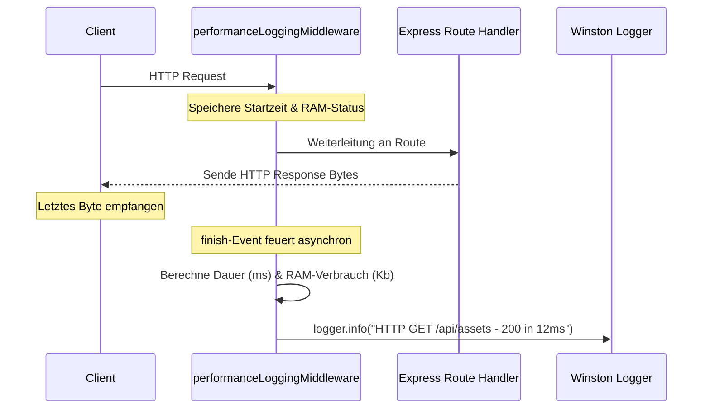

# 📡 Events & Lifecycle-Hooks
> **Spezifikation:** Version 0.5.5 (Beta-Phase)  
> **Konformität:** Event-driven Micro-Hooks, Nicht-blockierende Verbindungs-Überwachung

In CAPITAL-AI werden asynchrone Kommunikations- und Bereinigungsaufgaben ereignisgesteuert (Event-driven) gelöst. Das System lauscht auf spezifische Zustandsänderungen des Express HTTP-Lifecycles und des Netzwerk-Sockets, um die Integrität der Concurrency-Warteschlangen und der Performance-Metriken sicherzustellen.

---

## 🧭 Navigationsmenü

* [🏠 Hauptübersicht (README.md)](README.md)
* [⏳ Scheduler.md](Scheduler.md)
* [📡 Events.md](Events.md)
* [🌐 API-Flows.md](API-Flows.md)
* [🔄 Datenflüsse.md](Datenflüsse.md)
* [⏳ Cronjobs.md](Cronjobs.md)

---

## 📡 Übersicht aller System-Events & Hooks

| Event | Auslöser (Emitter) | Empfänger (Listener) | Quelldatei | Zweck |
| :--- | :---: | :---: | :--- | :--- |
| **`res.on('finish')`** | Node.js HTTP Response | Performance-Logging Middleware | `src/server/middleware.ts` | Berechnet Verarbeitungszeit, RAM-Delta und schreibt strukturierte Logeinträge. |
| **`res.on('close')`** | TCP Socket Disconnect / Client Cancel | Concurrency Queue / RequestOrchestrator | `src/lib/requestOrchestrator.ts` | Gibt sofort den reservierten Concurrency-Slot frei, falls der Client die Verbindung vorzeitig kappt. |
| **`Promise.all` Resolution** | Parallel AI Execution | Domain Orchestrators | `src/orchestrator/*` | Löst asynchron aus, sobald alle parallel aufgerufenen AI-Agenten geantwortet haben. |

---

## 1. Das `finish`-Event (Performance Telemetrie)

Sobald ein HTTP-Request vollständig verarbeitet und alle Bytes an den Client gesendet wurden, feuert Node.js das `finish`-Event auf dem Response-Objekt (`res`).

### Funktionsweise:
1. Die `performanceLoggingMiddleware` speichert beim Starten des Requests die exakte CPU-Zeit (`process.hrtime()`) und den aktuellen RAM-Verbrauch des Heaps.
2. Beim Eintreffen des `finish`-Events wird das Zeit- und Speicher-Delta berechnet.
3. Die Metriken werden an Winston übergeben und DSGVO-konform (maskierte IPs, entfernte Token) in das Zentral-Log geschrieben.



---

## 2. Das `close`-Event (Verbindungsschutz)

Bricht ein Benutzer die Ladezeit der Seite ab (z.B. durch Schließen des Tabs oder Klicken auf "Stop"), trennt sich der Socket. Hierbei feuert das `close`-Event.

### Kritische Wichtigkeit für die Concurrency-Warteschlange:
* Der `RequestOrchestrator` begrenzt rechenintensive LLM-Analysen auf maximal **3 parallele Durchläufe**.
* Würde ein Client bei laufender KI-Generierung abbrechen und der Server dies ignorieren, bliebe ein Concurrency-Slot blockiert ("Thread Starvation").
* Durch das Registrieren des `close`-Events wird bei vorzeitigem Abbruch der Slot sofort freigegeben:
  ```typescript
  res.on('close', () => {
    if (!released) {
      released = true;
      this.activeRequests.delete(requestId);
      this.processQueue(); // Nächsten wartenden Request aufrufen
    }
  });
  ```

---

## 3. `Promise.all` Multi-Agent Resolution Event

Die domänenspezifischen Orchestratoren bündeln mehrere asynchrone Agenten-Aufrufe. Durch die Nutzung des standardisierten Promise-Event-Modells blockieren sich die Agenten untereinander nicht:

* **Trigger:** Gleichzeitiger Aufruf von $N$ Agenten.
* **Resolution Event:** Sobald das letzte Promise gelöst ist, wird die Ausführung fortgesetzt. Schlägt ein einzelner Agent fehl, greift das interne Fehler-Fallback-System dieses Agenten, sodass die restliche Kette unbeeinträchtigt bleibt.
