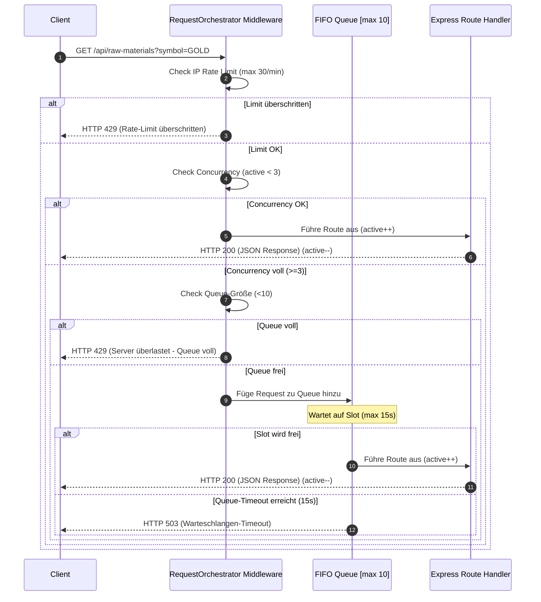
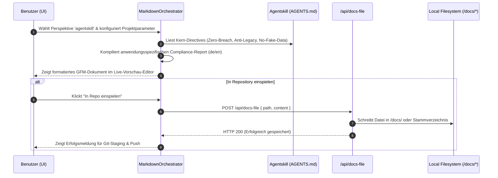

# 🧩 Orchestratoren (Orchestration Layer)
> **Spezifikation:** Version 0.5.5 (Beta-Phase)  
> **Konformität:** Nicht-blockierend, Parallelisierter Agentenaufruf, Determinismus

Die Orchestrierungsschicht ist das Gehirn des CAPITAL-AI-Backends. Sie teilt sich auf in:
1. **Den systemweiten Request-Orchestrator (`RequestOrchestrator`)**: Steuert das globale Thread-Budget, verhindert das Abstürzen des Servers unter hoher Last, drosselt unautorisierte Aufrufe und verwaltet die Warteschlangen.
2. **Die domänenspezifischen Orchestratoren**: Koordinieren das parallele Laden von spezialisierten AI-Agenten (Gemini 2.5) und übergeben deren strukturiertes Feedback an die mathematischen Scoring-Services.

---

## 🧭 Navigationsmenü

* [🏠 Hauptübersicht (README.md)](README.md)
* [⚙️ Automatisierungen.md](Automatisierungen.md)
* [🛡️ Richtlinien.md](Richtlinien.md)
* [🧩 Orchestratoren.md](Orchestratoren.md)
* [🤖 Agenten.md](Agenten.md)
* [📊 Komponentenübersicht.md](Komponentenübersicht.md)

---

## 🏛️ Systemweite & Domänenspezifische Orchestratoren im Überblick

| Orchestrator | Klasse | Dateipfad | Hauptverantwortung | Status |
| :--- | :--- | :--- | :--- | :---: |
| **Request / Gatekeeper** | `RequestOrchestrator` | `src/lib/requestOrchestrator.ts` | Concurrency, FIFO-Warteschlange, Ratenbegrenzung | 🟢 Aktiv |
| **Stock Orchestrator** | `StockOrchestrator` | `src/orchestrator/stockOrchestrator.ts` | Aktienbewertung (Value, Growth, Quality, DCF) | 🟢 Aktiv |
| **Crypto Orchestrator** | `CryptoOrchestrator` | `src/orchestrator/cryptoOrchestrator.ts` | On-Chain, Sentiment- & Risikoanalyse (L1/L2) | 🟢 Aktiv |
| **Meme-Coin Orchestrator** | `MemeCoinOrchestrator` | `src/orchestrator/memeCoinOrchestrator.ts` | Hype-Verlauf, Social Volume & Rugpull-Checks | 🟢 Aktiv |
| **Raw Materials Orchestrator** | `RawMaterialsOrchestrator` | `src/orchestrator/rawMaterialsOrchestrator.ts` | Geologische Erzgrade, Versorgungsketten-Resilienz | 🟢 Aktiv |
| **Markdown Orchestrator** | `MarkdownOrchestrator` | `src/components/orchestration/MarkdownOrchestrator.tsx` | Kompiliert & verwaltet rollenbasierte Berichte, integriert AI Agent Directives | 🟢 Aktiv |

---

## 1. RequestOrchestrator (Zentraler Gatekeeper)

* **Dateipfad:** `/src/lib/requestOrchestrator.ts`
* **Instanziierung:** Singleton-Export (`orchestrator = new RequestOrchestrator()`)
* **Konfiguration:**
  * `concurrencyLimit = 3` (Maximal 3 rechenintensive Gemini-Tasks parallel)
  * `maxQueueSize = 10` (Erhöht Warteschlange vor automatischer Ablehnung mit 429)
  * `queueTimeoutMs = 15000` (Maximal 15 Sekunden Wartezeit in der Schlange)
  * `rateLimitWindowMs = 60000` (1-Minute IP-Fenster)
  * `maxRequestsPerWindow = 30` (Maximal 30 Client-Aufrufe/Minute pro IP)

### Kernfunktionen:
* `handle(endpointKey: string)`: Express-Middleware zur Ratenbegrenzung und Concurrency-Prüfung.
* `getStats()`: Liefert Echtzeit-Telemetrie über aktive Requests, Queue-Größe und abgewiesene Verbindungen.
* `updateConfig(config)`: Ermöglicht die dynamische Anpassung von Schwellenwerten während des laufenden Betriebs.



---

## 2. Domänenspezifische Multi-Agent-Orchestratoren

Jeder der vier Domänen-Orchestratoren folgt einem strikt entkoppelten Ablaufmuster, um präzise, deterministische und auditerbare Ergebnisse zu erzeugen.

### A. RawMaterialsOrchestrator (Rohstoff-Bewertung)
* **Pfad:** `/src/orchestrator/rawMaterialsOrchestrator.ts`
* **AI-Modell:** `gemini-2.5-flash` via `@google/genai` TypeScript SDK.
* **Koordinierte Agenten (Parallelaufruf via `Promise.all`):**
  * `ClassificationAgent` (Klassifiziert in Hauptgruppe und Sub-Kategorie)
  * `FundamentalsAgent` (Geologische Grade, Tonnagen, Reserven, Recycling-Grad)
  * `RiskAgent` (ESG-Risiko, geopolitisches Risiko, Lieferketten-Resilienz)
  * `ValuationAgent` (Industrielle und militärisch-strategische Bedeutung)
* **Verknüpfte Scoring-Engine:** `RawMaterialsScoringService.scoreMaterial`
* **Input:** Rohstoffname (String) und optionale Überschreibungsparameter (`Partial<RawMaterialInput>`).
* **Output:** `AnalysisPayload` (Gesamtbewertung, Klassifizierung, strukturierte Begründung, granulare Indikatoren).

### B. CryptoOrchestrator (Enterprise-Kryptowährungen)
* **Pfad:** `/src/orchestrator/cryptoOrchestrator.ts`
* **Koordinierte Agenten:**
  * `CryptoClassificationAgent` (Klassifizierung nach L1, L2, Oracle, DeFi, Web3)
  * `CryptoOnChainAgent` (Aktive Adressen, Transaktionsfrequenz, Whale-Wallet-Aktivität)
  * `CryptoSentimentAgent` (Social Media Dynamik, Nachrichtenlage, Hype-Narrative)
  * `CryptoRiskAgent` (Wash-Trading Risiko, Zentralisierungs-Faktoren, Protokollsicherheit)
* **Verknüpfte Scoring-Engine:** `CryptoScoringService.scoreCrypto`
* **Ablauf:** Die qualitativen KI-Forschungsergebnisse (z.B. Whale-Wallet-Akkumulation oder Hype-Stärke) werden als numerische Koeffizienten in die standardisierte 100-Punkte-Scoringmatrix übergeben.

### C. MemeCoinOrchestrator (Spekulative Hype-Münzen)
* **Pfad:** `/src/orchestrator/memeCoinOrchestrator.ts`
* **Koordinierte Agenten:**
  * `MemeSentimentAgent` (Virales Potential, Influencer-Katalysatoren, Community-Wachstum)
  * `MemeRiskAgent` (Developer-Zentralisierung, Smart-Contract-Risiken, Liquiditätssperren)
* **Verknüpfte Scoring-Engine:** `MemeCoinScoringService.scoreMemeCoin`
* **Besonderheit:** Der Orchestrator bewertet extrem volatile Hype-Assets. Das Scoring-Modell enthält drakonische Malus-Punkte bei Erkennung von Insider-Aktivitäten oder ungesicherten Liquiditätspools.

### D. StockOrchestrator (Standard- & Bluechip-Aktien)
* **Pfad:** `/src/orchestrator/stockOrchestrator.ts`
* **Koordinierte Agenten:**
  * `StockClassificationAgent` (Wirtschaftssektor-Zuordnung, Liquiditätsprofil)
  * `StockFundamentalsAgent` (Umsatzwachstum 3Y, EPS-Wachstum, Reinvestitionsrate)
  * `StockValuationAgent` (KGV, KBV, EV/EBITDA, Dividendenrendite)
  * `StockRiskAgent` (Schulden-Eigenkapital-Verhältnis, Beta-Wert, Volatilität)
* **Verknüpfte Scoring-Engine:** `StockScoringService.scoreStock`

---

## 3. MarkdownOrchestrator (Multi-Perspective Compliance Engine)

* **Dateipfad:** `/src/components/orchestration/MarkdownOrchestrator.tsx`
* **Zweck:** Programmatische Kompilierung von Compliance-, Strategie- und Architekturdokumenten (Documentation-as-Code) direkt aus den parametrisierten Projekteinstellungen.
* **Modell-Integration (Agentskill):**
  * Integriert das zentrallager-basierte Regelwerk von `AGENTS.md` (Version 0.5.5) als dedizierte Perspektive.
  * Stellt sicher, dass alle generierten Dokumente und AI-Agent-Schnittstellen das **"No Fake Data"**-Mandat, das **"PII-Masking"**-Gebot und die **"Anti-Legacy-Versionierung"** strikt einhalten.
* **Input:** `OrchestratorConfig` (Projektname, Währung, Primärdatenbank, Analytischer Fokus, Sprache).
* **Output:** Auditierbare Markdown-Dokumente (`.md`), die direkt im Repository `/docs/` gespeichert oder kopiert/heruntergeladen werden können.

### 🎭 Die 9 Steuerungsperspektiven (Inklusive Agentskill-Integration)

1. **👔 CEO & Business Strategy (`ceo`)**: Liefert zukunftssichere KPIs, ROI-Analysen und DSGVO-Grenzwerte.
2. **🔒 Security & Compliance (`security`)**: Enforces OWASP-Top-10, Stripe Webhook Webhook raw-body Ingestion und Secret Isolation.
3. **🧪 QA & Test Plan (`qa`)**: Definiert Testabdeckungen für mathematische Formeln und UX-Vorgaben (>44px Touch Targets).
4. **💻 Code Quality & Clean Code (`code-quality`)**: Erzwingt striktes TypeScript, Modulares Splitting (<500 Zeilen) und render-stabile State-Hooks.
5. **✍️ Brand Persona & Copywriting (`content`)**: Sichert die disziplinierte Expert-Partner-Tonalität ohne Werbe-Hype.
6. **🔍 SEO & Technical Search (`seo`)**: Optimiert semantische Strukturen und eliminiert externe Webfont-Lecks (DSGVO-Sicherheit).
7. **🎨 Frontend-Architektur (`frontend`)**: Verwaltet Bento-Grids, Touch-Sizing und performante Motion-Transitions.
8. **⚙️ Backend Layer & API (`backend`)**: Koordiniert Server-seitiges Caching und Lazy-loading von Drittanbieter-SDKs.
9. **🛡️ AI Agent Directives (`agentskill` / `AGENTS.md`)**: **[INTEGRIERT]** Zentrale Steuerungsschleife zur Überwachung der Einhaltung aller AI-Sicherheits- und Datenintegritäts-Gebote.

### 🔗 Datenfluss & Staging-Zyklus des Markdown Orchestrators



---

## 🔄 Das Standardisierte Orchestrierungs-Entwurfsmuster

Jeder domänenspezifische Orchestrator folgt demselben robusten Softwaremuster:

```mermaid
graph LR
    subgraph Multi-Agenten-Pipeline (Parallel)
        A[Symbol / Name] --> B1(Agent 1: Classification)
        A --> B2(Agent 2: Fundamentals)
        A --> B3(Agent 3: Risk)
        A --> B4(Agent 4: Valuation)
    end

    B1 & B2 & B3 & B4 -->|JSON Extraktion| C[Zusammenführung mit statischen Datenbank-Parametern]
    C --> D[Mathematischer Scoring-Service (Verifizierung)]
    D --> E[Anreicherung der qualitativen Begründung (Reasoning Array)]
    E --> F[Standardisierter JSON Payload]
```
