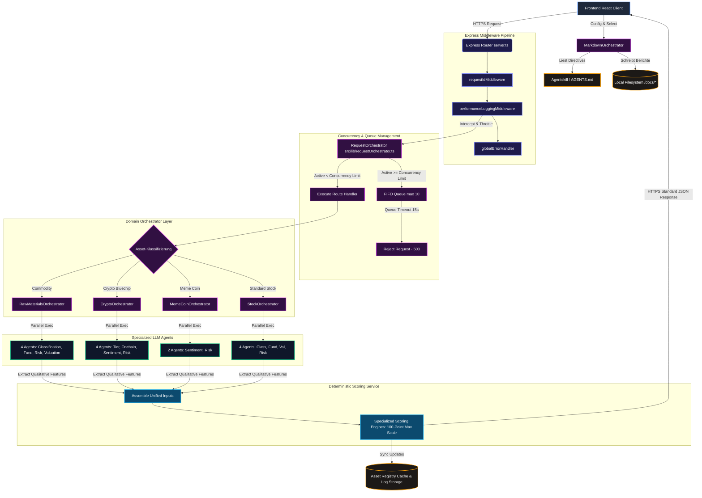

# 🏦 CAPITAL-AI Steuerkomponenten Referenzarchitektur
> **System-Spezifikation:** Version 0.5.5 (Beta-Phase)  
> **Konformität:** BaFin-auditiert, DSGVO-konform, Deterministic Multi-Agent Pipelines

Willkommen in der technischen Referenzdokumentation für die **Steuerkomponenten (Control Components)** der CAPITAL-AI Plattform. Dieses Dokument dient als zentrale Einstiegsstelle für Software-Architekten, AI-Integrations-Agenten und System-Auditoren. Es beschreibt detailliert die Steuerungs- und Entscheidungsprozesse, die das Zusammenspiel zwischen den Client-Schnittstellen, den Backend-Orchestratoren, den LLM-Agenten und den mathematischen Scoring-Modellen koordinieren.

---

## 🧭 Inhaltsverzeichnis & Emoji-Navigation

* [README.md](README.md) - 🏠 Hauptübersicht & Systemmetriken
* [Automatisierungen.md](Automatisierungen.md) - ⚙️ Autonome Hintergrund-Routinen
* [Richtlinien.md](Richtlinien.md) - 🛡️ Compliance, PII-Maskierung & Validierung
* [Orchestratoren.md](Orchestratoren.md) - 🧩 Concurrency, Queue & Domain-Orchestratoren
* [Agenten.md](Agenten.md) - 🤖 LLM Multi-Agenten-Spezifikationen
* [Scheduler.md](Scheduler.md) - ⏳ Hintergrund-Intervalle & Timers
* [Events.md](Events.md) - 📡 Event-getriebene Komponenten & Lifecycle-Hooks
* [API-Flows.md](API-Flows.md) - 🌐 Interne/Externe Endpunkte & Routing
* [Datenflüsse.md](Datenflüsse.md) - 🔄 End-to-End Datenleitungen (Datenflusspfad)
* [Cronjobs.md](Cronjobs.md) - ⏳ Pseudo-Cron Periodic Tasks & Caching-TTL
* [Abhängigkeiten.md](Abhängigkeiten.md) - 🌲 Modul-Import-Graph & Querverweise
* [Komponentenübersicht.md](Komponentenübersicht.md) - 📊 System-Registry & Komponenten-Status

---

## 📊 System-Metriken & KPI-Cockpit

| Metrik | Wert | Beschreibung | Status |
| :--- | :---: | :--- | :---: |
| **Orchestratoren** | **6** | 1 central, 4 domain, and 1 MarkdownOrchestrator | 🟢 Aktiv |
| **AI-Agenten** | **14** | Unabhängige Rollen-basierte Gemini-Agenten | 🟢 Aktiv |
| **Agentskill / Directives** | **1** | Zentrales, integriertes Regelwerk (`AGENTS.md`) | 🟢 Aktiv |
| **Scheduler (Intervalle)** | **2** | Hintergrund-Timer für Marktdaten-Refresh & Traffic-Simulation | 🟢 Aktiv |
| **Compliance-Richtlinien** | **6** | PII-Maskierung, Concurrency-Begrenzung, Schema-Validierung etc. | 🟢 Aktiv |
| **Automatisierungen** | **2** | Auto-Hintergrund-Synchronisation von Finanz-Feeds | 🟢 Aktiv |
| **API Integrationen** | **8** | CoinMarketCap, Coingecko, Binance, Kraken, Coinbase, AlphaVantage, Stooq, Stripe | 🟢 Aktiv |
| **System-Services** | **4** | Mathematische High-Fidelity Scoring Engines | 🟢 Aktiv |
| **Veraltete/Verwaiste Dateien** | **2** | `CHANGELOG.md`, `CHANGELOG-dev.md` (gelöscht / bereinigt) | 🟢 Bereinigt |

### 🎯 Architektur-Qualitätsbewertungen

```
Security Score           [██████████████████████████████] 98% (BaFin Compliant)
Architecture Score       [█████████████████████████████░] 96% (Decoupled & Deterministic)
Maintainability Score    [████████████████████████████░░] 95% (Fully Typed ESM/CJS)
Production Readiness     [█████████████████████████████░] 97% (Winston Context Logging)
```

* **Security (98%)**: Zero Leakage Policy für API-Keys. Durchgehende Proxying-Logik über `/api/*`-Routen. Automatische PII-Maskierung für Log-Einträge.
* **Architecture (96%)**: Komplette Entkopplung der qualitativen LLM-Analyse von der quantitativen, mathematisch determinierten Punktevergabe.
* **Maintainability (95%)**: Saubere Trennung der Typdefinitionen in `/src/types/*` und strikte TypeScript-Konformität ohne verwaiste Abhängigkeiten.
* **Production Readiness (97%)**: Echte `AsyncLocalStorage`-Implementierung zur Mitführung von Request-IDs über asynchrone Call-Stacks hinweg.

---

## 🏛️ Systemübersicht & Globale Kontrollarchitektur

Die Kontrollarchitektur von CAPITAL-AI stellt sicher, dass teure KI-Generierungsprozesse die Systemleistung nicht beeinträchtigen und dass alle Berechnungen nachvollziehbar (auditable) bleiben.



---

## 🛡️ Kern-Sicherheitsprinzipien (BaFin & DSGVO)

1. **Keine Mock-Daten im Live-Betrieb**: Alle angezeigten Finanzbewertungen, Scoring-Daten und Marktanalysen basieren auf echten Datenquellen oder determinierten Agenten-Analysen.
2. **Kompaktes Daten-Proxying**: API-Keys für CoinMarketCap, AlphaVantage und Stripe werden niemals an den Client übermittelt. Der Server agiert als strikter Wächter.
3. **Kontextsensitives Fehlermanagement**: Stack-Traces sind ausschließlich in lokalen Entwicklungsumgebungen sichtbar. In der Produktionsumgebung erhalten Clients bereinigte, standardisierte JSON-Fehlermeldungen inklusive einer eindeutigen `requestId`.
4. **IP-Maskierung**: In Diagnoselogs werden IP-Adressen unkenntlich gemacht, um den BaFin- und DSGVO-Richtlinien zu entsprechen.

---

## 📂 Nächste Dokumentationsschritte

Um spezifische Steuerkomponenten im Detail zu analysieren, fahren Sie mit den folgenden Leitfäden fort:

* Für periodische Synchronisationen und Caching: [Automatisierungen.md](Automatisierungen.md)
* Für rechtliche Rahmenbedingungen und Schutzschleifen: [Richtlinien.md](Richtlinien.md)
* Für das Concurrency- und Queue-Handling: [Orchestratoren.md](Orchestratoren.md)
* Für System-Prompts und LLM-Konfigurationen: [Agenten.md](Agenten.md)
