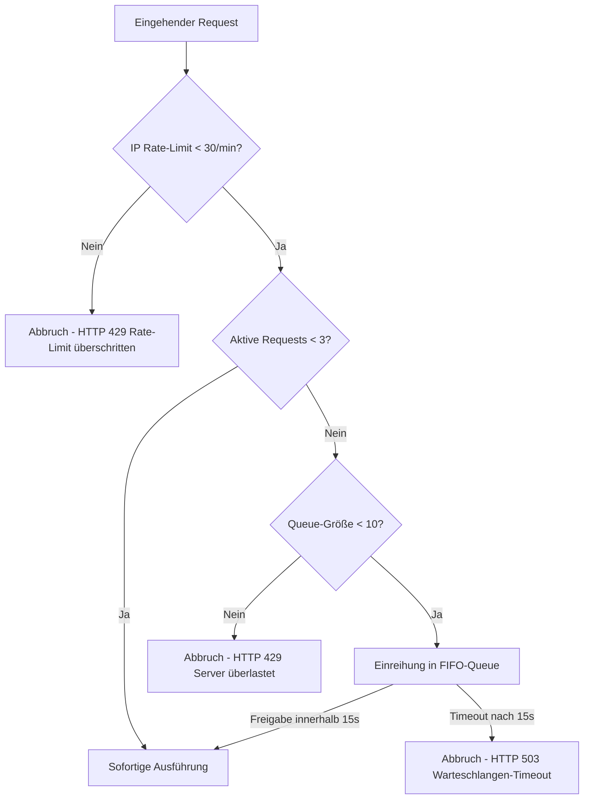

# 🛡️ Richtlinien & Sicherheitsregeln
> **Spezifikation:** Version 0.5.5 (Beta-Phase)  
> **Konformität:** BaFin-konform, DSGVO-konform, OWASP API Security Top 10

Dieses Dokument detailliert die gesetzlichen und technischen Schutzmechanismen der CAPITAL-AI Plattform. Alle System-Komponenten und Entwickler-Agenten müssen diese Richtlinien strikt umsetzen. Sicherheitsverletzungen führen zu automatischen Abbruchszenarien in der Pipeline.

---

## 🧭 Navigationsmenü

* [🏠 Hauptübersicht (README.md)](README.md)
* [⚙️ Automatisierungen.md](Automatisierungen.md)
* [🛡️ Richtlinien.md](Richtlinien.md)
* [🧩 Orchestratoren.md](Orchestratoren.md)
* [🤖 Agenten.md](Agenten.md)
* [📊 Komponentenübersicht.md](Komponentenübersicht.md)

---

## 🔒 1. Datenzugriffskontrolle & PII-Maskierung (Datenschutz)

Zur Einhaltung der DSGVO und zum Schutz personenbezogener Daten (PII) implementiert das System ein vollautomatisches Redaktionssystem im Logging- und Auswertungsprozess.

### Maskierungsregeln für IP-Adressen (`RequestOrchestrator.maskIp`):
* **IPv4-Maskierung:** Das letzte Oktett einer IPv4-Adresse wird durch Sternchen ersetzt (z.B. `192.168.1.123` ──> `192.168.1.***`).
* **IPv6-Maskierung:** Adressen werden ab dem 3. Block gekürzt (z.B. `2001:0db8:85a3:0000:0000:8a2e:0370:7334` ──> `2001:0db8:85a3::***`).
* **Sonderfälle:** Standard-Localhost-Kennungen (`::1`, `127.0.0.1`, `unknown`) bleiben unverändert für internes Routing.

### Redigierung vertraulicher Token (Winston Filter):
Alle ausgehenden Logs werden vor dem Schreiben auf das Vorhandensein sensibler Schlüssel untersucht. Folgende Keys werden automatisch durch `[REDACTED]` ersetzt:
* `STRIPE_SECRET_KEY`, `GEMINI_API_KEY`, `COINMARKETCAP_API_KEY`, `SUPABASE_KEY`
* JWTs werden über einen regulären Ausdruck gefiltert:
  $$\text{Regex:} \quad \texttt{/eyJhbGciOi...[a-zA-Z0-9\-\_]+\.[a-zA-Z0-9\-\_]+/g}$$

---

## 🛑 2. System-Limits, Throttling & Rate-Limiting

Zum Schutz der externen API-Budgets (insb. Google Gemini Token-Limits) und zur Vermeidung von Denial-of-Service (DoS) Angriffen gelten folgende Grenzwerte:

| Richtlinie | Typ | Parameterwert | Datei / Pfad | Status |
| :--- | :--- | :---: | :--- | :---: |
| **Max Concurrency** | Limit | Max. 3 parallele KI-Analysen | `src/lib/requestOrchestrator.ts` | 🟢 Aktiv |
| **Max Queue Size** | Limit | Max. 10 Anfragen in Warteschlange | `src/lib/requestOrchestrator.ts` | 🟢 Aktiv |
| **Queue Timeout** | Timeout | 15.000 Millisekunden | `src/lib/requestOrchestrator.ts` | 🟢 Aktiv |
| **IP-Rate Limit** | Throttle | Max. 30 Requests pro IP / Minute | `src/lib/requestOrchestrator.ts` | 🟢 Aktiv |
| **CORS Whitelist** | Policy | Nur vertrauenswürdige Domänen | `server.ts` | 🟢 Aktiv |

---

## 📋 3. Schema-Validierung & Dateneingangsprüfung

Jeder API-Aufruf an das Bewertungssystem wird vor der Verarbeitung streng auf Typ- und Werte-Konformität geprüft.

### Aktien-Validierung:
* **Pfad:** `/src/schemas/stockValidation.ts`
* **Prüfungen:**
  * Symbol vorhanden und im Großformat (`AAPL`, `MSFT`).
  * Mathematische Plausibilität der Kennzahlen (z.B. KGV $> 0$, Verschuldungsgrad im realistischen Bereich).

### Rohstoff-Validierung:
* **Pfad:** `/src/schemas/rawMaterialsValidation.ts`
* **Prüfungen:**
  * Zuordnung zu erlaubten Rohstoffgruppen (`Metal`, `Energy`, `Agriculture`, `Industrial`, `Recycling`).
  * Plausibilität der Erzgrade ($0.0 \le \text{grade} \le 100.0$) und Tonnagen.

---

## 🌐 4. CORS, CSP & Header-Security Policies

Der Server implementiert strikte HTTP-Header zum Schutz des Clients im iFrame-Kontext (AI-Studio Sandbox):

* **Content-Security-Policy (CSP):**
  * `script-src`: Erlaubt ausschließlich `'self'`, `'unsafe-inline'`, `'unsafe-eval'` und Stripe-Skripte (`https://*.stripe.com`).
  * `frame-ancestors`: Erlaubt das Einbetten der Web-App in Google AI Studio (`https://ai.studio`), Cloud Run (`https://*.run.app`) und Localhost.
* **CORS-Policy:**
  * Erlaubt Anfragen nur von validierten Staging-/Production-URLs. Wildcards (`*`) sind für authentifizierte Routen strengstens verboten.

---

## 📌 5. Richtlinie zur Reversionsfreiheit & Versionierung

* **Versions-Pinning:** Alle Systemkomponenten, Fehlerklassen, Diagnoserouten und Dokumente sind permanent auf **Version 0.5.5 (Beta-Phase)** festgelegt.
* **Anti-Legacy Richtlinie:** Jegliche Erwähnung veralteter Versionen (z.B. v1.0.0, v7.5) ist im Code untersagt, um Verwirrung bei automatisierten AI-Code-Generatoren zu verhindern.
* **Modell-Unabhängigkeit:** Backend-Calls müssen so gekapselt sein, dass das zugrunde liegende AI-Modell (z.B. Wechsel von Gemini 2.5 auf neuere Versionen) ohne Code-Refactoring im Frontend ausgetauscht werden kann.

---

## 🤖 6. AI Agent Directives (Agentskill Regelwerk)

* **Definition & Pfad:** `AGENTS.md` & `GEMINI.md` im Projektstamm.
* **Status:** 🟢 Aktiv & Systemweit injiziert.

Diese globalen Steuerungsdirektiven bilden den "Agentskill" der CAPITAL-AI Plattform und werden vom System automatisch in alle Model-Prompts und System-Prompts injiziert, um datenschutz- und compliance-konformes Verhalten der KIs zu garantieren.

### Drei-Säulen-Sicherheitsdirektiven:
1. **Datenintegrität & No-Fake-Data Gebot**:
   * Keine fiktiven Werte oder Lückenfüller ("Lorem Ipsum") in Benutzer-Vorschauen oder persistenten Speichern.
   * Streng mathematische Verifikation aller Datenfeeds vor dem Scoring-Eingang.
2. **Harded Data Access Control & Privacy**:
   * Maskierung, Verschleierung und Anonymisierung aller PII-Daten (IPs, E-Mails, Zahlungsdaten).
   * Verbot von API-Schlüsseln oder kryptografischen Secrets im Frontend-Client. Sämtliche API-Anfragen verbleiben proxy-geschützt im Backend.
3. **Legacy-Noise Prevention**:
   * Strikte Fixierung aller Plattform-Referenzen auf **Version 0.5.5 (Beta-Phase)** zur Absicherung vor fehlerhaften LLM-Halluzinationen oder veralteten Routing-Versionen.
