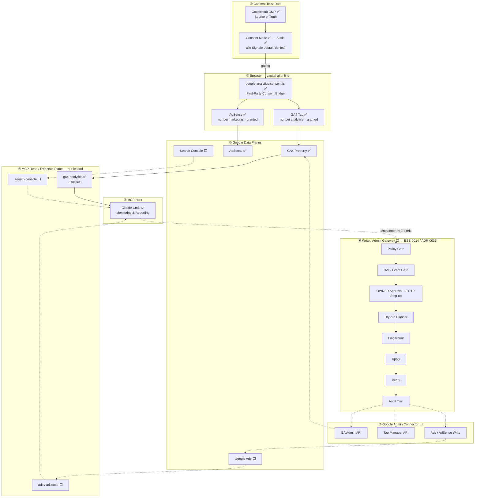

<!-- CAPITAL-AI DOCUMENTARY HEADER START -->

## Owner-Änderung 2026-09-15 — FE-CONSENT-V3 / Variante A

**Freigabe:** „Variante A freigegeben“ im zugehörigen Owner-Chat. **Aktivierung:** erst nach Human Merge und separat autorisierter Production-Promotion; Branch-Evidence ist keine Production Acceptance.

Dieser begrenzte Änderungszusatz ersetzt mit Aktivierung ausschließlich die unten beschriebenen CookieHub-Providerbindungen und die AdSense-Ladefreigabe: Selbst gehostetes CookieConsent v3.1.0 wird Consent Source of Truth; Google Analytics bleibt im Basic Mode hinter einem gültigen Analytics-Opt-in. AdSense bleibt vollständig pausiert und alle Werbesignale bleiben `denied`, auch nach „Alle akzeptieren“. Historische CookieHub-Zustimmungen werden nicht übernommen.

Die bisher genannten CookieHub-SDK-/Initializer-/CSP-/Event-Invarianten sind danach historische Providerbindungen. An ihre Stelle treten gepinnte lokale SDK/CSS/License-Dateien, `public/cookieconsent-init.js`, `CookieConsent.validConsent()` plus `acceptedCategory('analytics')` und die auf `window` registrierten Events `cc:onConsent` / `cc:onChange`. Der gespeicherte Widerruf deaktiviert GA, löscht erreichbare GA-Cookies und lädt nach vorheriger GA-Ausführung einmal neu. Die alleinige First-Party-Bridge bleibt `public/google-analytics-consent.js`.

Keine globale Supersession: Zero Google network before opt-in, Basic Consent Mode v2, CSP-Nonce/Report-Only-Grenze, geschützte Pfade/Schutzprüfungen, IAM, Human-/CODEOWNER-Review, Produktionsfreigaben und unabhängige SEC/COMP-Assurance gelten weiter. Neue Consent-Assets werden zusätzlich geschützt. Alte Audit-Evidence wird nicht umgeschrieben. Ein zentraler anonymer Consent-Log-Dienst wird nicht behauptet; Bewertung des lokalen Nachweises bleibt ein COMP-Handoff. AMP-/SEO-Verhalten wird durch diesen Zusatz nicht erweitert.

Umsetzung und Nachweis: `docs/runbooks/GOOGLE_ANALYTICS_SETUP.md` und `docs/projects/frontend/evidence/COOKIECONSENT_V3_MIGRATION_2026-09-15.md`.

---

  <svg viewBox="0 0 200 180" width="100" height="90" style="filter: drop-shadow(0px 0px 15px rgba(194, 157, 83, 0.35));" aria-hidden="true">
    <g stroke="#C29D53" stroke-width="2" stroke-opacity="0.6">
      <line x1="60" y1="50" x2="78" y2="93" />
      <line x1="78" y1="93" x2="60" y2="135" />
      <line x1="60" y1="135" x2="100" y2="145" />
      <line x1="100" y1="145" x2="140" y2="133" />
      <line x1="140" y1="133" x2="142" y2="90" />
      <line x1="142" y1="90" x2="140" y2="48" />
      <line x1="140" y1="48" x2="105" y2="55" />
      <line x1="105" y1="55" x2="60" y2="50" />
      <line x1="100" y1="100" x2="60" y2="50" stroke="#06B6D4" />
      <line x1="100" y1="100" x2="140" y2="48" stroke="#06B6D4" />
      <line x1="100" y1="100" x2="140" y2="133" stroke="#8B5CF6" />
      <line x1="100" y1="100" x2="60" y2="135" stroke="#8B5CF6" />
    </g>
    <circle cx="60" cy="50" r="7" fill="#E5C17C" />
    <circle cx="140" cy="48" r="7" fill="#E5C17C" />
    <circle cx="140" cy="133" r="7" fill="#E5C17C" />
    <circle cx="60" cy="135" r="7" fill="#E5C17C" />
    <circle cx="100" cy="100" r="12" fill="#BD984E" />
    <circle cx="78" cy="93" r="5" fill="#E5C17C" />
    <circle cx="142" cy="90" r="5" fill="#E5C17C" />
    <circle cx="100" cy="145" r="5" fill="#E5C17C" />
    <circle cx="105" cy="55" r="5" fill="#E5C17C" />
  </svg>

  <h1 style="margin-top: 10px; margin-bottom: 2px; font-weight: 900; color: #E5C17C; letter-spacing: -0.04em; font-family: 'Space Grotesk', sans-serif; text-transform: uppercase;">⊞ Capital-AI Documentary</h1>
  
Autonomous AI Document Hygienist • Version 0.5.4

| System-Metadaten | Spezifikation |
| :--- | :--- |
| **Plattform-Identität** | Capital-AI Documentary (V0.5.4) |
| **Gründer & Inhaber** | **Sven Kulessa** |
| **Zentrale E-Mail** | [sven.kulessa@capital-ai.online](mailto:sven.kulessa@capital-ai.online) |
| **Echtheits-Emblem** | `⊞ CAPITAL-AI CORE` |
| **Status** | 🟢 Revisionssicher verifiziert & bereinigt |

---
<!-- CAPITAL-AI DOCUMENTARY HEADER END -->

# Google Marketing MCP — Topologie für Marketing-Monitoring

## Document ID

ARCH-TOPO-0001

## Bezug

- `.ai/skills/ESS-0014-Google-Marketing-MCP-Governance.md` (normativ)
- `docs/adr/ADR-0035-protected-google-marketing-integration-strict-csp.md`
- `docs/adr/ADR-0040-csp-runtime-remediation-safe-rollout.md`
- `docs/adr/ADR-0042-basic-consent-mode-v2-google-tag-gating.md`
- `docs/architecture/CAPITAL_AI_GOOGLE_MARKETING_MCP_ARCHITECTURE.md` (Implementierungsprofil)
- `.mcp.json`, `docs/seo/SEO_MANAGEMENT_ROADMAP.md`

## Status

Aktiv — Topologie-Übersicht zum Repository-Stand `1809f03` (08.08.2026).

Dieses Dokument ist **deskriptiv**: es zeigt, was heute real läuft und was spezifiziert, aber
nicht implementiert ist. Es erteilt keine Berechtigungen und ersetzt weder ESS-0014 noch ADR-0035.

---

## 1. Gesamttopologie

**Legende:** ✅ implementiert und im Betrieb · ⬜ spezifiziert, **nicht** implementiert

---

## 2. Verbindliche Leseregeln der Grafik

1. **Ebene ① ist der Trust Root, nicht Google.** Ohne CookieHub-Opt-in wird kein Google-Tag
   geladen und kein Google-Request ausgelöst. Consent Mode v2 läuft im **Basic Mode**; Advanced
   Mode mit cookieless pings ist ausdrücklich ausgeschlossen (ADR-0042).
2. **Ebene ④ ist strikt lesend.** Der offizielle Google-Analytics-MCP wird als Read-/Evidence-Plane
   behandelt. Es werden keine Schreibfähigkeiten erfunden (ESS-0014).
3. **Der Pfad ⑤ → ⑥ ist gestrichelt und heute nicht vorhanden.** Mutationen dürfen niemals direkt
   am MCP hängen, sondern ausschließlich durch die vollständige Gate-Kette
   Policy → IAM/Grant → OWNER-Approval+TOTP → Dry-run → Fingerprint → Apply → Verify → Audit.
4. **Claude ist Implementierungs-/MCP-Host, keine Autorisierungsinstanz.** Weder Modellidentität
   noch Repository-Schreibrechte ersetzen einen CAPITAL-AI-OWNER.

---

## 3. Realer Implementierungsstand (Stand `1809f03`)

| Baustein | Status | Nachweis |
|---|---|---|
| CookieHub CMP | ✅ | `index.html`, `public/cookiehub-init.js` |
| Consent Bridge / Consent Mode v2 Basic | ✅ | `public/google-analytics-consent.js`, ADR-0042 |
| GA4 Tag, consent-gated | ✅ | `index.html` Meta `ga-measurement-id`, Bridge-Injektion |
| AdSense, consent-gated | ✅ | `index.html` Meta `adsense-publisher-id` |
| MCP Read-Server `ga4-analytics` | ✅ | `.mcp.json` |
| Search-Console-Read-Plane | ⬜ | kein Eintrag in `.mcp.json` |
| Ads-/AdSense-Read-Plane | ⬜ | dito |
| Write-/Admin-Gateway (⑥) | ⬜ | `server/googleMarketing/` existiert nicht |
| Google Admin Connector (⑦) | ⬜ | dito |
| Invarianten-Gate im Build | ✅ | `scripts/security/verifyGoogleMarketingInvariants.ts`, `.github/workflows/google-marketing-protected-change.yml` |

Von sieben Ebenen sind **① bis ⑤ produktiv**, **⑥ und ⑦ ausschließlich spezifiziert**.

---

## 4. Erweiterungspunkte

Die Topologie ist bewusst additiv erweiterbar:

- **Neue Read-Quelle** (z. B. Search Console): Eintrag in `.mcp.json` ergänzen, Zugangsdaten über
  die Umgebungs-Secret-Konfiguration bereitstellen, Kategorie/Consent-Bezug im
  `DATENSCHUTZ_PROTOKOLL.md` dokumentieren. Kein Eingriff in Ebene ① oder ② nötig.
- **Neuer Consent-pflichtiger Tag**: ausschließlich über die Bridge in Ebene ②, gekoppelt an eine
  CookieHub-Kategorie — niemals als unbedingtes Script im `<head>`.
- **Erste Schreibfähigkeit**: erfordert Ebene ⑥ vollständig, einen eigenen ADR und eine
  OWNER-Freigabe. Eine Teilimplementierung der Gate-Kette ist ausdrücklich unzulässig.

Der geplante Ausbaupfad ist in `docs/seo/SEO_MANAGEMENT_ROADMAP.md` terminiert (`D5` Search
Console, `H2` Google Admin Connector).

---

## Fußnote zur Header-Version

Der Documentary-Header nennt „Version 0.5.4", während `package.json` auf `0.6.0` steht. Diese
Abweichung besteht identisch in allen zehn Bestandsdokumenten mit diesem Header und wird hier
bewusst unverändert übernommen; ihre Pflege gehört der Documentary-/VersionManager-Engine, nicht
diesem Dokument.

